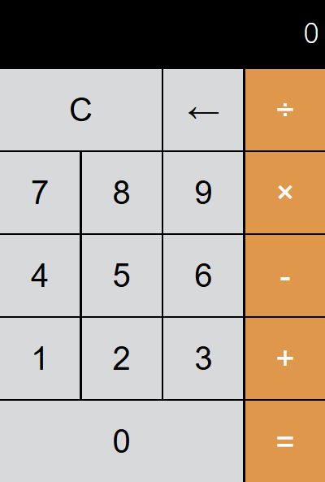

# Calculadora Web

Simples calculadora web responsiva feita com HTML, CSS e JavaScript que realiza operações aritméticas básicas.

[Live Demo](https://paulorj21.github.io/calculadora/)

## Features

- **Operações Básicas**: Adição (+), Subtração (-), Multiplicação (×), Divisão (÷)
- **Clear Function**: Reseta o display com o botão 'C'
- **Backspace**: Remove o último dígito com o botão '←'
  
## Estrutura do Projeto

- **index.html**: Estrutura HTML principal
- **style.css**: Estilização da calculadora
- **script.js**: Lógica e funcionalidade da calculadora

## Tecnologias
- HTML5
- CSS3
- JavaScript Vanilla

## Design

*Inspirado no design iOS*
